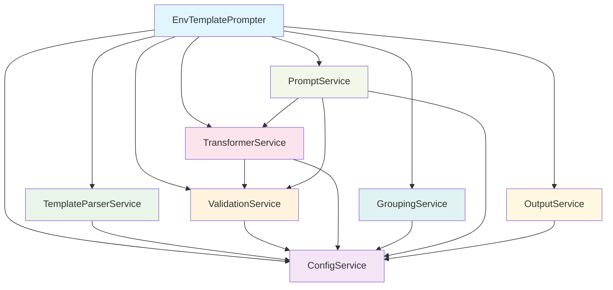

# 🏗️ Service Architecture Specification

## 🎯 Architecture Overview

The `@repo/env-template-prompter` package follows a **service-oriented architecture** with **dependency injection** principles inspired by NestJS. Each service has a single responsibility and clear dependencies, enabling comprehensive testing and maintainability.

## 🔗 Service Dependency Graph



## 🧩 Service Specifications

### 🔧 ConfigService
**Role:** Runtime configuration and debug management  
**Dependencies:** None (foundation service)  
**Singleton:** Yes  

```typescript
interface RuntimeConfig {
  debugMode: boolean;
  templatePath: string;
  outputPath: string;
  skipExisting: boolean;
  interactive: boolean;
}

class ConfigService {
  private config: RuntimeConfig;
  private debugHandlers: DebugHandler[];
  
  // Configuration Management
  setDebugMode(enabled: boolean): void;
  getConfig(): RuntimeConfig;
  updateConfig(partial: Partial<RuntimeConfig>): void;
  
  // Debug System
  debug(message: string, context?: string): void;
  addDebugHandler(handler: DebugHandler): void;
  removeDebugHandler(handler: DebugHandler): void;
  
  // Validation
  validateConfig(): ValidationResult;
}
```

**Key Responsibilities:**
- Runtime configuration storage and validation
- Debug output coordination across all services
- Environment variable resolution
- Configuration merging and defaults

### 📋 TemplateParserService
**Role:** Parse .env.template files into structured field definitions  
**Dependencies:** ConfigService  
**Singleton:** No  

```typescript
interface TemplateField {
  key: string;
  type: FieldType;
  options: FieldOptions;
  rawLine: string;
  lineNumber: number;
  group?: string;
}

interface FieldOptions {
  value?: string;
  message?: string;
  group?: string;
  transformer?: string;
  source?: string;
  auto_derive?: boolean;
  validate?: string;
  min?: number;
  max?: number;
  allow?: string;
  [key: string]: unknown;
}

class TemplateParserService {
  constructor(private configService: ConfigService) {}
  
  // Core Parsing
  parseTemplate(content: string): TemplateField[];
  parseTemplateFile(filePath: string): Promise<TemplateField[]>;
  
  // Field Extraction
  extractFieldDefinition(line: string): TemplateField | null;
  parseFieldOptions(optionsString: string): FieldOptions;
  parseFieldType(typeString: string): FieldType;
  
  // Validation
  validateTemplateStructure(fields: TemplateField[]): ValidationResult;
  
  // Utilities
  resolveIncludes(content: string): string;
  extractComments(content: string): Map<string, string>;
}
```

**Key Responsibilities:**
- Parse complex template syntax `{{type|param=value|param2=value2}}`
- Extract field definitions with proper type inference
- Handle template includes and comments
- Validate template structure and syntax

### ✅ ValidationService
**Role:** Validate user input and field constraints  
**Dependencies:** ConfigService  
**Singleton:** No  

```typescript
interface ValidationResult {
  valid: boolean;
  errors: string[];
  warnings: string[];
  value?: string;
}

interface ValidatorPlugin {
  name: string;
  validate(value: string, params: Record<string, string>): boolean | Promise<boolean>;
  message?: string;
}

class ValidationService {
  constructor(private configService: ConfigService) {}
  
  // Field Validation
  validateField(value: string, field: TemplateField): Promise<ValidationResult>;
  validateFieldType(value: string, type: FieldType): boolean;
  
  // Type-Specific Validators
  validateUrl(url: string, options?: URLValidationOptions): boolean;
  validateNumber(value: string, options: NumberValidationOptions): boolean;
  validateString(value: string, options: StringValidationOptions): boolean;
  validateBoolean(value: string): boolean;
  validateEmail(value: string): boolean;
  validatePort(value: string, options?: PortValidationOptions): boolean;
  
  // Plugin System
  registerValidator(plugin: ValidatorPlugin): void;
  unregisterValidator(name: string): void;
  getRegisteredValidators(): ValidatorPlugin[];
  
  // Custom Validation
  validateWithCustomRule(value: string, rule: string): Promise<ValidationResult>;
}
```

**Key Responsibilities:**
- Input validation for all field types
- Plugin-based custom validation
- Error message generation
- Constraint checking (min/max/allow/etc.)

### 🔄 TransformerService
**Role:** Apply transformations to field values  
**Dependencies:** ValidationService, ConfigService  
**Singleton:** No  

```typescript
interface TransformerPlugin {
  name: string;
  transform(value: string, params: Record<string, string>, context: TransformContext): string | Promise<string>;
  description?: string;
  requiresSource?: boolean;
}

interface TransformContext {
  sourceValue: string;
  allValues: Map<string, string>;
  field: TemplateField;
  templateFields: TemplateField[];
}

class TransformerService {
  constructor(
    private validationService: ValidationService,
    private configService: ConfigService
  ) {}
  
  // Transformation Execution
  applyTransformers(field: TemplateField, context: TransformContext): Promise<string>;
  transformValue(value: string, transformerName: string, params: Record<string, string>, context: TransformContext): Promise<string>;
  
  // Plugin Management
  registerTransformer(plugin: TransformerPlugin): void;
  unregisterTransformer(name: string): void;
  getRegisteredTransformers(): TransformerPlugin[];
  
  // Built-in Transformers
  getBuiltInTransformers(): TransformerPlugin[];
  
  // Value Resolution
  resolveSourceValue(field: TemplateField, context: TransformContext): string;
  resolvePlaceholders(value: string, context: TransformContext): string;
}
```

**Key Responsibilities:**
- Execute field transformations
- Manage transformer plugins
- Built-in transformer implementations
- Variable reference resolution (@{VAR}, ${expression})

### 📊 GroupingService
**Role:** Organize fields into logical groups for presentation  
**Dependencies:** ConfigService  
**Singleton:** No  

```typescript
interface GroupedFields {
  groups: Map<string, TemplateField[]>;
  ungrouped: TemplateField[];
  groupTitles: Map<string, string>;
  groupOrder: string[];
}

interface GroupConfiguration {
  groups: Record<string, string>;
  autoDetect: boolean;
  ungroupedTitle: string;
}

class GroupingService {
  constructor(private configService: ConfigService) {}
  
  // Primary Grouping
  groupFields(fields: TemplateField[], config?: GroupConfiguration): GroupedFields;
  
  // Configuration Parsing
  parseExplicitGroups(configString: string): Record<string, string>;
  extractGroupConfiguration(fields: TemplateField[]): GroupConfiguration | null;
  
  // Auto-Detection
  autoDetectGroups(fields: TemplateField[]): Record<string, string>;
  generateGroupTitle(groupKey: string): string;
  
  // Group Ordering
  orderGroups(groups: Map<string, TemplateField[]>, config: GroupConfiguration): string[];
  prioritizeGroups(groupNames: string[]): string[];
  
  // Utilities
  assignFieldToGroup(field: TemplateField, groups: Record<string, string>): string | null;
  validateGroupConfiguration(config: GroupConfiguration): ValidationResult;
}
```

**Key Responsibilities:**
- Parse explicit group configuration from template
- Auto-detect groups from field prefixes
- Generate user-friendly group titles
- Order groups for optimal UX

### 💬 PromptService
**Role:** Handle interactive user prompts and input collection  
**Dependencies:** ValidationService, TransformerService, ConfigService  
**Singleton:** No  

```typescript
interface PromptContext {
  existingValues: Map<string, string>;
  groupTitle?: string;
  skipExisting: boolean;
  interactive: boolean;
}

interface PromptResult {
  value: string;
  skipped: boolean;
  derived: boolean;
  error?: string;
}

class PromptService {
  constructor(
    private validationService: ValidationService,
    private transformerService: TransformerService,
    private configService: ConfigService
  ) {}
  
  // Primary Prompting
  promptForField(field: TemplateField, context: PromptContext): Promise<PromptResult>;
  promptForGroup(groupName: string, fields: TemplateField[], context: PromptContext): Promise<Map<string, PromptResult>>;
  
  // Prompt Logic
  shouldSkipField(field: TemplateField, context: PromptContext): boolean;
  shouldAutoDerive(field: TemplateField, context: PromptContext): Promise<boolean>;
  generatePromptMessage(field: TemplateField): string;
  
  // User Interface
  displayGroupHeader(groupName: string, groupTitle: string): void;
  displayProgress(current: number, total: number): void;
  displayValidationError(error: string): void;
  displaySummary(results: Map<string, PromptResult>): void;
  
  // Input Handling
  collectUserInput(field: TemplateField, message: string): Promise<string>;
  validateAndRetry(field: TemplateField, context: PromptContext): Promise<string>;
  
  // Non-Interactive Mode
  processNonInteractive(fields: TemplateField[], defaultValues: Map<string, string>): Promise<Map<string, PromptResult>>;
}
```

**Key Responsibilities:**
- Interactive prompt management
- Auto-derivation logic for dependent fields
- Progress display and user feedback
- Non-interactive mode support

### 📝 OutputService
**Role:** Generate and write .env files with proper formatting  
**Dependencies:** ConfigService  
**Singleton:** No  

```typescript
interface OutputOptions {
  includeComments: boolean;
  preserveOrder: boolean;
  groupSeparators: boolean;
  timestampHeader: boolean;
}

interface OutputResult {
  success: boolean;
  path: string;
  content: string;
  fieldCount: number;
  errors: string[];
}

class OutputService {
  constructor(private configService: ConfigService) {}
  
  // File Generation
  generateEnvFile(values: Map<string, string>, template: TemplateField[], options?: OutputOptions): string;
  writeEnvFile(content: string, path: string): Promise<OutputResult>;
  
  // Content Formatting
  formatFieldValue(key: string, value: string, field: TemplateField): string;
  addComments(content: string, fields: TemplateField[]): string;
  addGroupSeparators(content: string, groups: GroupedFields): string;
  addHeader(content: string, timestamp: boolean): string;
  
  // Backup and Safety
  createBackup(path: string): Promise<string>;
  validateOutput(content: string): ValidationResult;
  
  // Multiple Output Formats
  generateDockerComposeEnv(values: Map<string, string>): string;
  generateJSONConfig(values: Map<string, string>): string;
  generateYAMLConfig(values: Map<string, string>): string;
  
  // File System Operations
  ensureDirectoryExists(path: string): Promise<void>;
  checkWritePermissions(path: string): Promise<boolean>;
}
```

**Key Responsibilities:**
- .env file generation with proper formatting
- Comments and group separator insertion
- Backup creation and safety checks
- Multiple output format support

## 🔗 Service Orchestration

### EnvTemplatePrompter (Main Orchestrator)
**Role:** Coordinate all services to process templates  
**Dependencies:** All services  
**Singleton:** Yes  

```typescript
interface ProcessOptions {
  interactive?: boolean;
  skipExisting?: boolean;
  defaultValues?: Map<string, string>;
  outputFormat?: 'env' | 'json' | 'yaml';
}

interface ProcessResult {
  success: boolean;
  fieldCount: number;
  outputPath: string;
  values: Map<string, string>;
  errors: string[];
  warnings: string[];
  duration: number;
}

class EnvTemplatePrompter {
  private services: ServiceContainer;
  
  constructor(config: EnvTemplatePrompterConfig) {
    this.services = this.createServices(config);
  }
  
  // Main Processing
  processTemplate(options?: ProcessOptions): Promise<ProcessResult>;
  processTemplateFile(path: string, options?: ProcessOptions): Promise<ProcessResult>;
  
  // Plugin Management
  registerTransformer(plugin: TransformerPlugin): void;
  registerValidator(plugin: ValidatorPlugin): void;
  
  // Configuration
  updateConfig(config: Partial<EnvTemplatePrompterConfig>): void;
  getConfig(): EnvTemplatePrompterConfig;
  
  // Utilities
  validateTemplate(path: string): Promise<ValidationResult>;
  previewOutput(path: string, values: Map<string, string>): Promise<string>;
  
  // Service Access
  getServices(): ServiceContainer;
  
  // Private Methods
  private createServices(config: EnvTemplatePrompterConfig): ServiceContainer;
  private processFields(fields: TemplateField[], options: ProcessOptions): Promise<Map<string, string>>;
  private handleErrors(errors: string[]): void;
}
```

## 📦 Dependency Injection Strategy

### Service Container
```typescript
interface ServiceContainer {
  configService: ConfigService;
  templateParserService: TemplateParserService;
  validationService: ValidationService;
  transformerService: TransformerService;
  groupingService: GroupingService;
  promptService: PromptService;
  outputService: OutputService;
}

class ServiceFactory {
  static createServices(config: EnvTemplatePrompterConfig): ServiceContainer {
    // Manual dependency injection for simplicity
    const configService = new ConfigService(config);
    const templateParserService = new TemplateParserService(configService);
    const validationService = new ValidationService(configService);
    const transformerService = new TransformerService(validationService, configService);
    const groupingService = new GroupingService(configService);
    const promptService = new PromptService(validationService, transformerService, configService);
    const outputService = new OutputService(configService);
    
    return {
      configService,
      templateParserService,
      validationService,
      transformerService,
      groupingService,
      promptService,
      outputService
    };
  }
}
```

### Service Lifecycle
1. **Creation:** Services created in dependency order
2. **Configuration:** Each service configured through constructor injection
3. **Registration:** Plugins registered after service creation
4. **Execution:** Services called in logical workflow order
5. **Cleanup:** Services cleaned up after processing complete

## 🧪 Testing Architecture

### Service Testing Strategy
Each service will be tested in isolation with mocked dependencies:

```typescript
// Example: ValidationService testing
describe('ValidationService', () => {
  let validationService: ValidationService;
  let mockConfigService: jest.Mocked<ConfigService>;
  
  beforeEach(() => {
    mockConfigService = createMockConfigService();
    validationService = new ValidationService(mockConfigService);
  });
  
  describe('validateUrl', () => {
    it('should validate correct URLs', () => {
      expect(validationService.validateUrl('https://example.com')).toBe(true);
    });
    
    it('should reject invalid URLs', () => {
      expect(validationService.validateUrl('not-a-url')).toBe(false);
    });
  });
});
```

### Integration Testing
Service interactions tested with real dependencies:

```typescript
describe('Service Integration', () => {
  let container: ServiceContainer;
  
  beforeEach(() => {
    container = ServiceFactory.createServices(testConfig);
  });
  
  it('should process template end-to-end', async () => {
    const fields = await container.templateParserService.parseTemplate(testTemplate);
    const grouped = container.groupingService.groupFields(fields);
    // ... continue testing integration
  });
});
```

## 🔄 Error Handling Strategy

### Service-Level Error Handling
Each service implements consistent error handling:

```typescript
interface ServiceError {
  code: string;
  message: string;
  context?: Record<string, unknown>;
  recoverable: boolean;
}

abstract class BaseService {
  protected handleError(error: unknown, context?: string): ServiceError {
    // Standardized error handling
  }
  
  protected logError(error: ServiceError): void {
    // Consistent error logging
  }
}
```

### Error Propagation
- **Service Errors:** Caught and transformed to ServiceError
- **Validation Errors:** Returned as ValidationResult
- **System Errors:** Propagated to main orchestrator
- **User Errors:** Displayed with recovery options

This architecture ensures maintainability, testability, and extensibility while preserving all existing functionality from the current init.js implementation.
